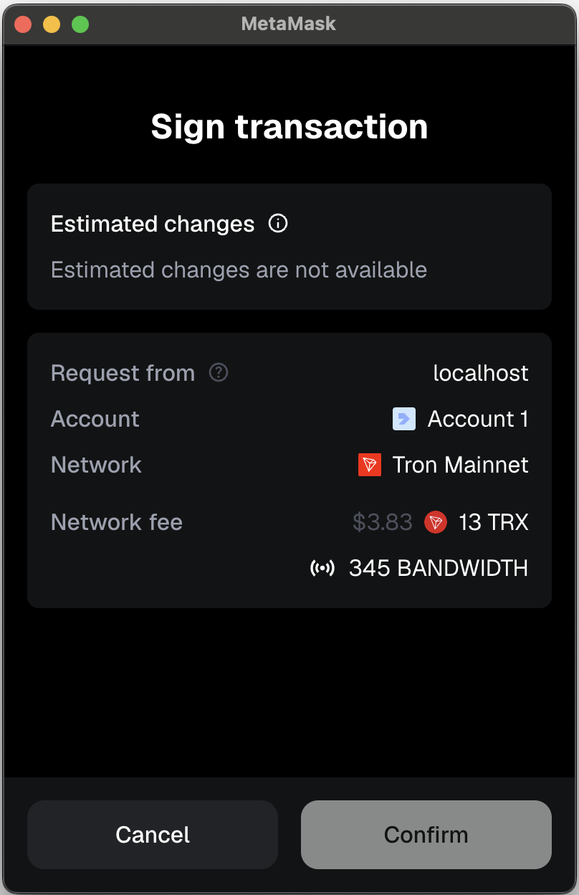

# Tron MetaMask Example

Demo app testing Tron transactions via MetaMask.

## Setup

```bash
# From monorepo root
yarn install
```

## Development

```bash
yarn dev
```

## What it does

The transaction resets approval on the [WIF token](https://tronscan.org/#/token20/TNSnUP15DW8B4E5mCNCdnuCJbHRwRNFAaB).

## Known Issue

The "Confirm" button in MetaMask is always inactive when signing Tron transactions:



This appears to be a MetaMask limitation when handling Tron network transactions.
